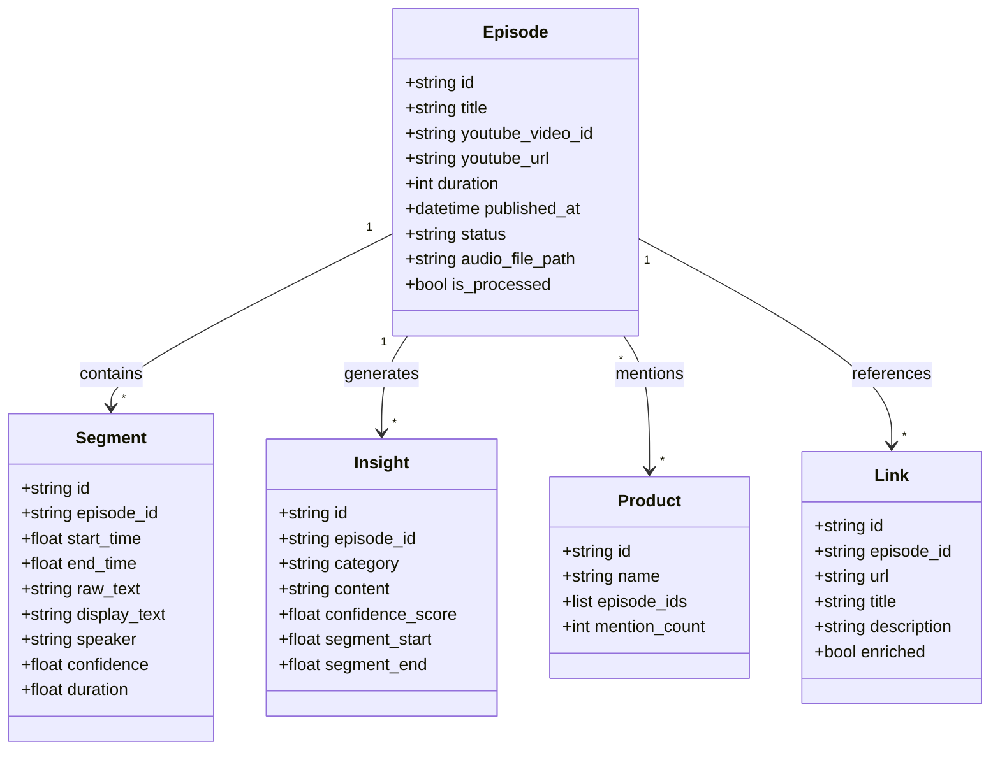

# Build Vault Embeddings Demo

A educational demonstration of building a knowledge vault with vector embeddings from podcast transcriptions. This project showcases modern AI/ML techniques for content processing, insight extraction, and semantic search.

## 🎯 Key Features

- **Audio Download**: Automatically downloads audio from YouTube
- **Transcription**: Converts audio to text using AssemblyAI's speaker diarization
- **Insight Extraction**: Uses LLMs to extract key insights, products, and ideas
- **Vector Embeddings**: Creates semantic embeddings using OpenAI's embedding models
- **Semantic Search**: Enables similarity-based search using ChromaDB vector database
- **Interactive Viewer**: Browse and explore the embedded content with a user-friendly interface

## 🛠️ Prerequisites

1. **Python 3.8+** installed on your system
2. **API Keys** (free tiers available):
   - [OpenAI API Key](https://platform.openai.com/api-keys)
   - [AssemblyAI API Key](https://www.assemblyai.com/)
   - [YouTube API Key](https://developers.google.com/youtube/v3/getting-started)

## 🚀 Quick Start

### 1. Clone the repository
```bash
git clone https://github.com/yourusername/build-vault-embeddings-demo.git
cd build-vault-embeddings-demo
```

### 2. Configure environment
```bash
cp env.example .env
```

Edit `.env` and add your API keys:
```
YOUTUBE_URL=https://www.youtube.com/watch?v=YOUR_VIDEO_ID (i.e. https://www.youtube.com/watch?v=9I_WxAMQ9_0&t=3s)
YOUTUBE_API_KEY=your_youtube_api_key_here
ASSEMBLYAI_API_KEY=your_assemblyai_key_here
OPENAI_API_KEY=your_openai_key_here
LLM_MODEL=gpt-4.1-mini
EMBEDDING_MODEL=text-embedding-3-small
```

### 3. Run the pipeline
Open a terminal in this directory and run `build_vault_demo.ipynb` in Jupyter Notebook:
```bash
jupyter notebook build_vault_demo.ipynb
```


### Educational Concepts

This project demonstrates several key concepts:

- **Vector Embeddings**: High-dimensional representations of text that capture semantic meaning
- **Semantic Search**: Finding similar content based on meaning rather than keywords
- **LLM Processing**: Using language models to extract structured insights from unstructured text
- **Vector Databases**: Specialized databases for storing and querying embeddings


### Data Model



## 📚 Educational Notes

### Understanding Embeddings
Embeddings are numerical representations of text that capture semantic meaning. Similar concepts are represented by vectors that are close together in the embedding space.

### Why ChromaDB?
ChromaDB is an open-source vector database that makes it easy to store and query embeddings. It handles the complexity of similarity search algorithms.

### Customization Options
- Modify `pipeline_config.json` to:
  - Change batch sizes for processing
  - Update the list of known products
  - Customize insight extraction prompts
  - Adjust semantic search parameters

### Cost Considerations
- OpenAI API costs: ~$0.02 per 1M tokens for embeddings
- AssemblyAI: ~$0.65 per hour of audio
- Most podcasts will cost < $1 to process

## 🔧 Troubleshooting

- **Import errors**: Ensure all packages are installed: `pip install -r requirements.txt`
- **API errors**: Verify your API keys are correctly set in `.env`
- **ChromaDB errors**: Delete `local_data/chromadb/` and re-run the pipeline

## 📖 Learn More

- [OpenAI Embeddings Guide](https://platform.openai.com/docs/guides/embeddings)
- [ChromaDB Documentation](https://docs.trychroma.com/)
- [AssemblyAI Transcription](https://www.assemblyai.com/docs)
- [Vector Database Concepts](https://www.pinecone.io/learn/vector-database/)

---

Built for demonstration purposes on The Build Podcast.