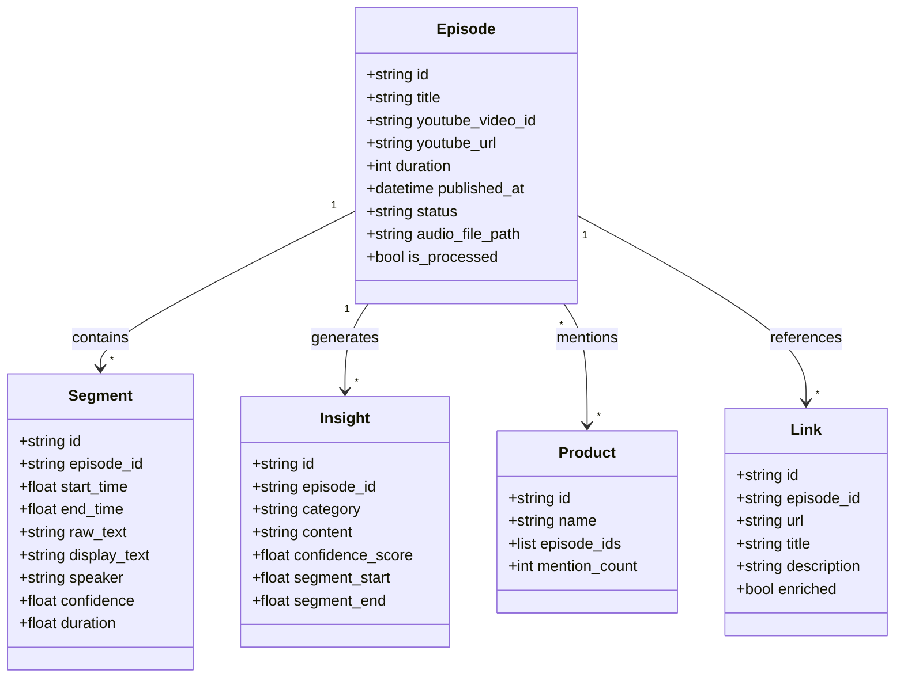
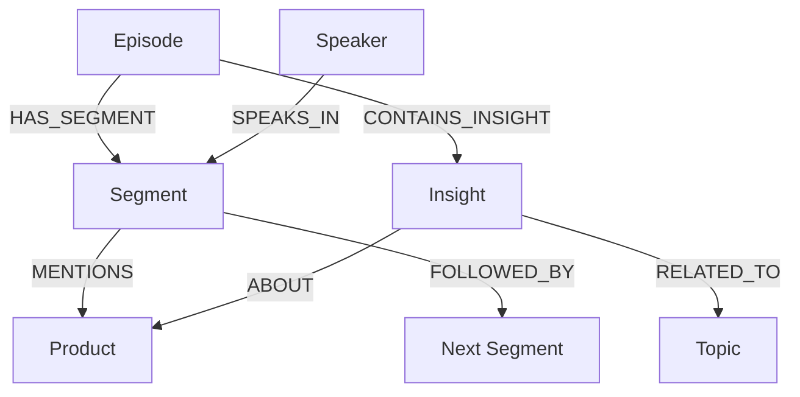

# Build Vault Embeddings Demo

A educational demonstration of building a knowledge vault with vector embeddings from podcast transcriptions. This project showcases modern AI/ML techniques for content processing, insight extraction, and semantic search.

## 🎯 Key Features

- **Audio Download**: Automatically downloads audio from YouTube
- **Transcription**: Converts audio to text using AssemblyAI's speaker diarization
- **Insight Extraction**: Uses LLMs to extract key insights, products, and ideas
- **Vector Embeddings**: Creates semantic embeddings using OpenAI's embedding models
- **Semantic Search**: Enables similarity-based search using ChromaDB vector database
- **Graph-based QA**: Query podcast content using Neo4j knowledge graphs and natural language
- **Interactive Viewer**: Browse and explore the embedded content with a user-friendly interface

## 🛠️ Prerequisites

1. **Python 3.8+** installed on your system
2. **API Keys** (free tiers available):
   - [OpenAI API Key](https://platform.openai.com/api-keys)
   - [AssemblyAI API Key](https://www.assemblyai.com/)
   - [YouTube API Key](https://developers.google.com/youtube/v3/getting-started)
   - [Groq API Key](https://console.groq.com/) (optional, for Groq LLM support)
3. **Neo4j Database** (for GraphRAG):
   - [Neo4j Desktop](https://neo4j.com/download/) or cloud instance
   - Connection credentials (URI, username, password)

## 🚀 Quick Start

### 1. Clone the repository
```bash
git clone https://github.com/yourusername/build-vault-embeddings-demo.git
cd build-vault-embeddings-demo
```

### 2. Configure environment
```bash
cp env.example .env
```

Edit `.env` and add your API keys:
```
YOUTUBE_URL=https://www.youtube.com/watch?v=YOUR_VIDEO_ID (i.e. https://www.youtube.com/watch?v=9I_WxAMQ9_0&t=3s)
YOUTUBE_API_KEY=your_youtube_api_key_here
ASSEMBLYAI_API_KEY=your_assemblyai_key_here
OPENAI_API_KEY=your_openai_key_here
LLM_MODEL=gpt-4o-mini
EMBEDDING_MODEL=text-embedding-3-small

# Optional: For GraphRAG with Neo4j
NEO4J_URI=neo4j://localhost:7687
NEO4J_USER=neo4j
NEO4J_PW=your_neo4j_password

# Optional: For Groq LLM support
GROQ_API_KEY=your_groq_api_key_here

# Optional: For local Ollama models
LLM_BASE_URL=http://localhost:11434
LLM_TEMPERATURE=0.0
```

### 3. Run the pipeline

#### Option A: ChromaDB Embeddings Pipeline
Open a terminal in this directory and run `youtube_embeddings_chromadb.ipynb` in Jupyter Notebook:
```bash
jupyter notebook youtube_embeddings_chromadb.ipynb
```

#### Option B: Neo4j GraphRAG Pipeline
After running the embeddings pipeline, you can explore the data with graph-based QA:
```bash
jupyter notebook youtube_graphqa_neo4j.ipynb
```


### Educational Concepts

This project demonstrates several key concepts:

- **Vector Embeddings**: High-dimensional representations of text that capture semantic meaning
- **Semantic Search**: Finding similar content based on meaning rather than keywords
- **LLM Processing**: Using language models to extract structured insights from unstructured text
- **Vector Databases**: Specialized databases for storing and querying embeddings
- **Knowledge Graphs**: Graph databases that represent entities and their relationships
- **GraphRAG**: Retrieval-Augmented Generation using graph databases for context-aware Q&A


### Data Model



### Neo4j Graph Schema

The GraphRAG implementation uses the following graph structure:



**Node Types:**
- **Episode**: YouTube video/podcast episode
- **Segment**: Transcript segments with timestamps
- **Speaker**: Individual speakers in the podcast
- **Insight**: Extracted insights with categories
- **Product**: Mentioned products/tools
- **Topic**: Discussion topics derived from insights

**Relationships:**
- `HAS_SEGMENT`: Links episodes to their transcript segments
- `SPEAKS_IN`: Links speakers to the segments they spoke
- `MENTIONS`: Links segments to products they mention
- `FOLLOWED_BY`: Temporal flow between segments
- `CONTAINS_INSIGHT`: Links episodes to extracted insights
- `ABOUT`: Links insights to products they discuss
- `RELATED_TO`: Links insights to their topic categories

## 📚 Educational Notes

### Understanding Embeddings
Embeddings are numerical representations of text that capture semantic meaning. Similar concepts are represented by vectors that are close together in the embedding space.

### Why ChromaDB?
ChromaDB is an open-source vector database that makes it easy to store and query embeddings. It handles the complexity of similarity search algorithms.

### Why Neo4j for GraphRAG?
Neo4j is a graph database that excels at storing and querying relationships between entities. For podcast analysis, it allows us to:
- Track who said what and when
- Find connections between products, topics, and speakers
- Query temporal relationships in conversations
- Perform complex multi-hop queries using natural language

### Example GraphRAG Queries

With the Neo4j implementation, you can ask natural language questions like:
- "Which products were discussed most frequently?"
- "Show the timeline of topics discussed"
- "Find all insights about AI and machine learning"
- "Which speaker talked the most about technical topics?"
- "Show conversation flow between speakers"
- "Find products that are mentioned together"

### Customization Options
- Modify `pipeline_config.json` to:
  - Change batch sizes for processing
  - Update the list of known products
  - Customize insight extraction prompts
  - Adjust semantic search parameters

### Cost Considerations
- OpenAI API costs: ~$0.02 per 1M tokens for embeddings
- AssemblyAI: ~$0.65 per hour of audio
- Most podcasts will cost < $1 to process

## 🔧 Troubleshooting

- **Import errors**: Ensure all packages are installed: `pip install -r requirements.txt`
- **API errors**: Verify your API keys are correctly set in `.env`
- **ChromaDB errors**: Delete `local_data/chromadb/` and re-run the pipeline

## 📖 Learn More

- [OpenAI Embeddings Guide](https://platform.openai.com/docs/guides/embeddings)
- [ChromaDB Documentation](https://docs.trychroma.com/)
- [AssemblyAI Transcription](https://www.assemblyai.com/docs)
- [Vector Database Concepts](https://www.pinecone.io/learn/vector-database/)
- [Neo4j Graph Database](https://neo4j.com/docs/)
- [LangChain GraphCypherQAChain](https://python.langchain.com/docs/integrations/graphs/neo4j_cypher)
- [GraphRAG Concepts](https://www.microsoft.com/en-us/research/blog/graphrag-unlocking-llm-discovery-on-narrative-private-data/)

---

Built for demonstration purposes on The Build Podcast.